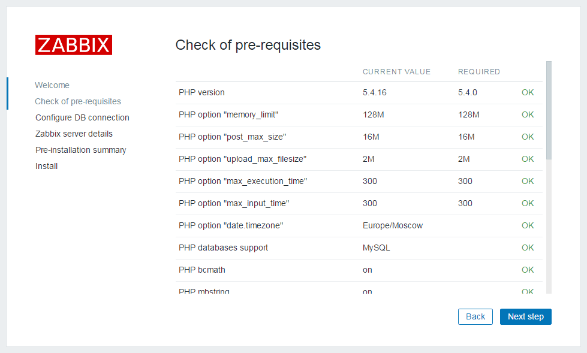
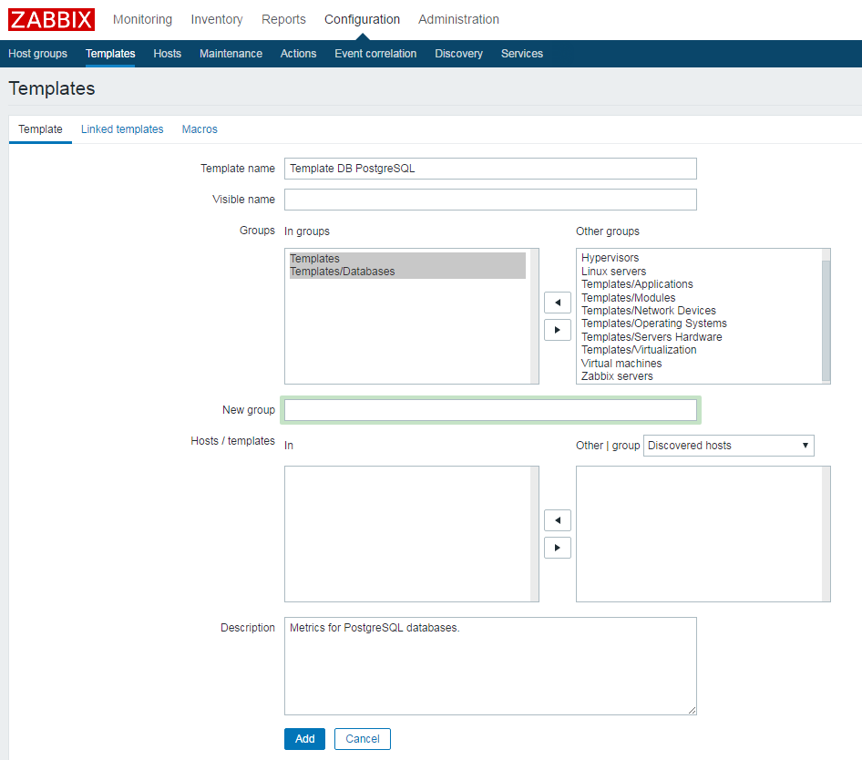
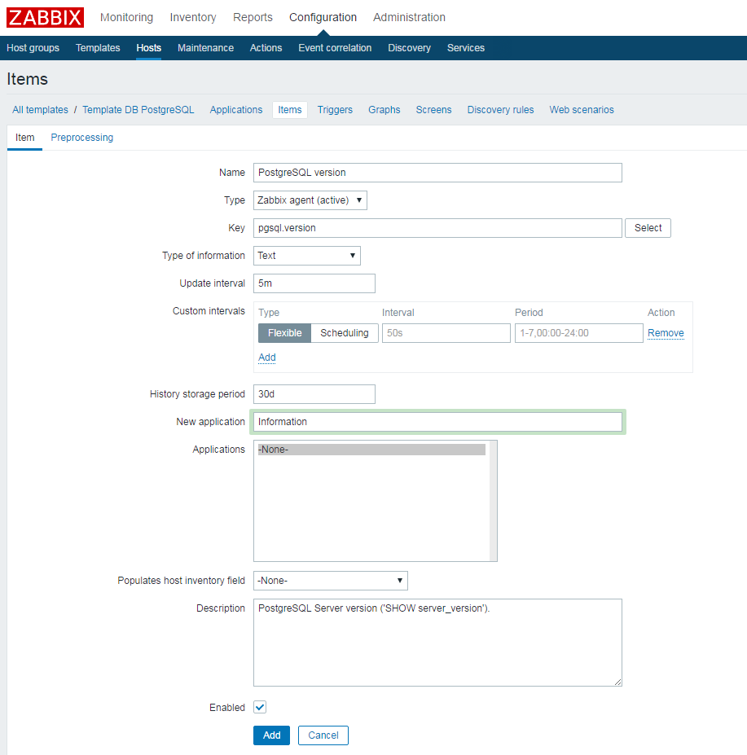
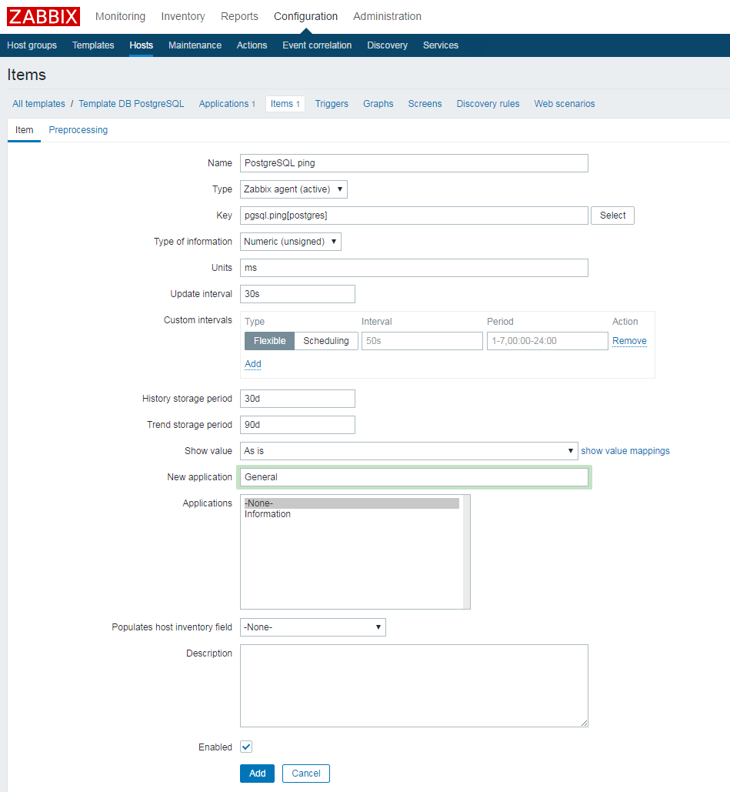
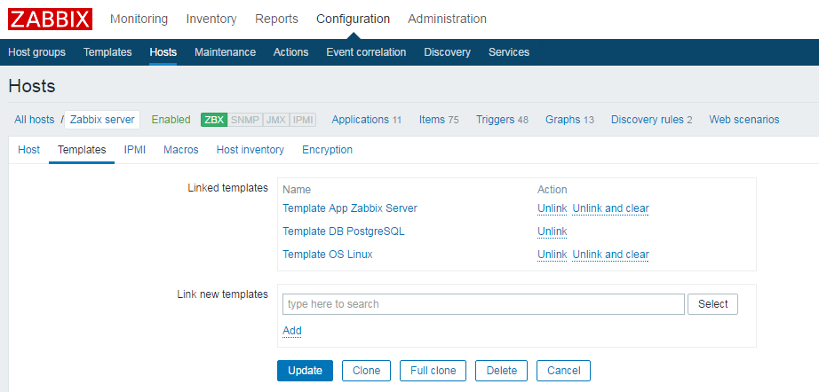
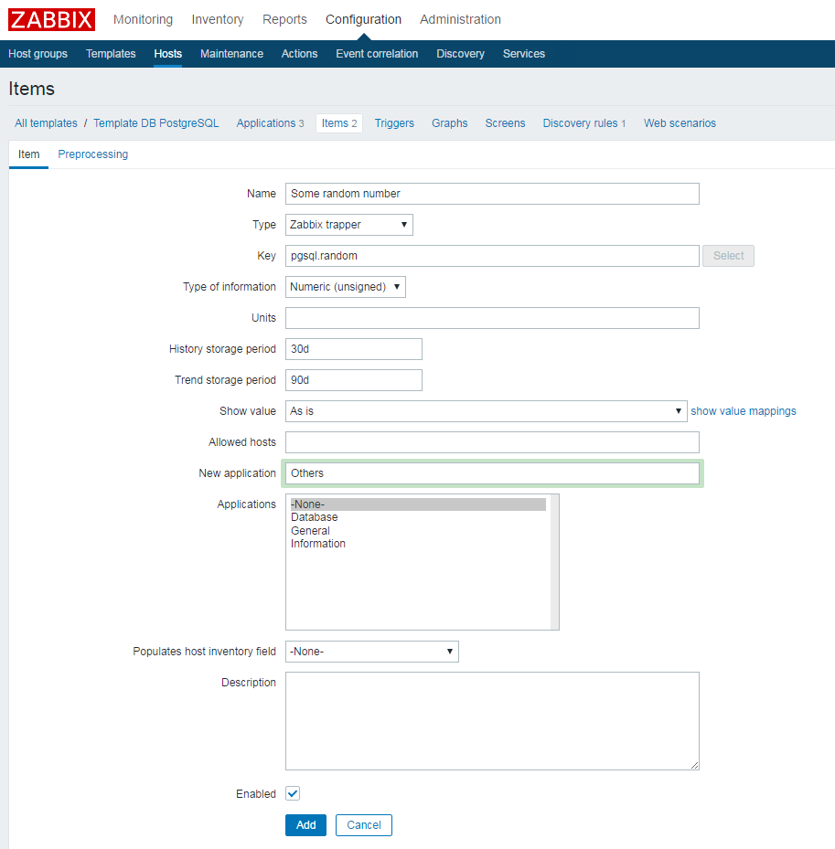
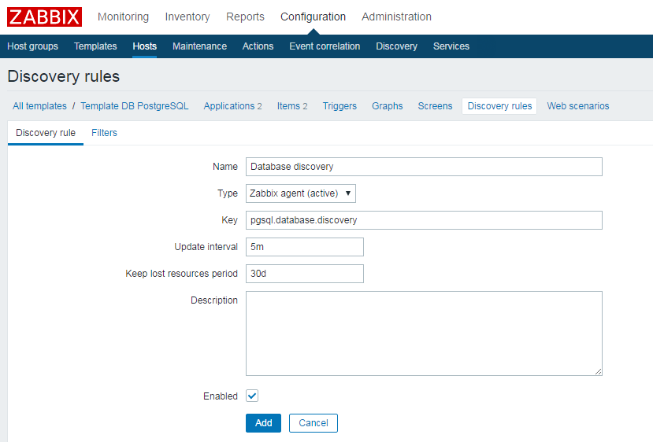
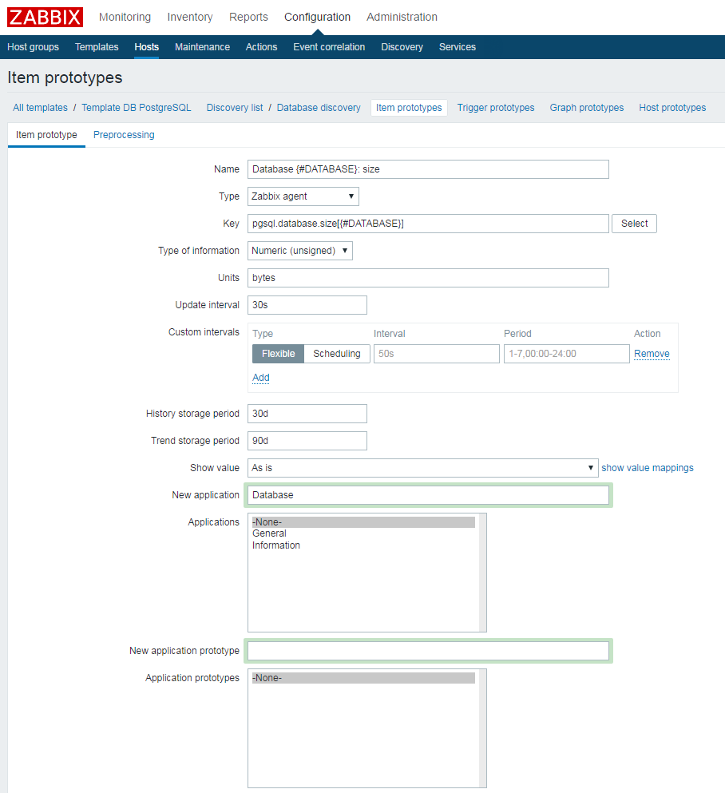
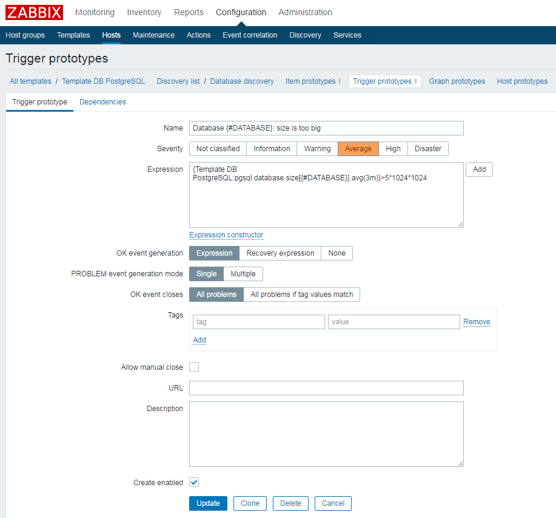

## Описание
На этой лекции мы поговорим о мониторинге на примере [Zabbix](https://www.zabbix.com/). <br>
[Презентация в PDF](monitoring-zabbix.pdf).

## Домашнее задание
В рамках домашнего задания вы узнаете как 
 - установить и настроить Zabbix
 - установить и настроить Grafana

Также вы научитесь:
 - собирать кастомные метрики
 - создавать шаблоны, элементы данных, триггеры
 - использовать низкоуровневое обнаружение (LLD)
<br>

 
### Задание 1. Установка и настройка Zabbix Server
Можно воспользоваться [инструкцией по установке Zabbix 3.4 для CentOS 7, описанной в официальной документации](https://www.zabbix.com/documentation/3.4/manual/installation/install_from_packages/rhel_centos), либо использовать выжимку ниже.

* [Добавляем репозиторий Zabbix](https://www.zabbix.com/documentation/3.4/manual/installation/install_from_packages/rhel_centos#adding_zabbix_repository):
  ```bash
  sudo rpm -ivh https://repo.zabbix.com/zabbix/3.4/rhel/7/x86_64/zabbix-release-3.4-2.el7.noarch.rpm
  ```

* [Активируем репозиторий опциональных rpm-пакетов](https://www.zabbix.com/documentation/3.4/manual/installation/install_from_packages/rhel_centos#frontend_installation_prerequisites):
  ```bash
  sudo yum-config-manager --enable rhel-7-server-optional-rpms
  ```

* [Устанавливаем Zabbix Server с поддержкой MySQL](https://www.zabbix.com/documentation/3.4/manual/installation/install_from_packages/rhel_centos#frontend_installation_prerequisites):
  ```bash
  sudo yum install zabbix-server-mysql
  ```

* [Устанавливаем веб-интерфейс с поддержкой MySQL](https://www.zabbix.com/documentation/3.4/manual/installation/install_from_packages/rhel_centos#frontend_installation_prerequisites):
  ```bash
  sudo yum install zabbix-web-mysql
  ```

* [Устанавливаем MariaDB](https://mariadb.com/kb/en/library/yum/) (ответвление MySQL):
  ```bash
  sudo yum install mariadb mariadb-server
  ```

* Запускаем MariaDB + включаем автозапуск сервиса MariaDB:
  ```bash
  sudo systemctl start mariadb && sudo systemctl enable mariadb.service
  ```

* Инициализируем БД с помощью скрипта:
  ```bash
  sudo /usr/bin/mysql_secure_installation
  ```
  [Пример параметров инициализации](mysql_secure_installation.stdout)

* [Создаем пользователя + БД в MySQL + раздаем привилегии](https://www.zabbix.com/documentation/3.4/manual/appendix/install/db_scripts#mysql).<br>
  Заходим в MySQL:
  ```bash
  mysql -uroot -pROOTUSERPASSWORD
  ```
  Cоздаем пользователя `zabbix`, БД с именем `zabbix`, даем права пользователю `zabbix` выполнять любые действия в БД `zabbix` **локально** (т.е. нельзя будет подключиться к этой БД под этим пользователем с другого хоста):
  ```sql
  create database zabbix character set utf8 collate utf8_bin;
  grant all privileges on zabbix.* to zabbix@localhost identified by 'ZABBIXUSERPASSWORD';
  quit;
  ```
  где:<br>
  `ROOTUSERPASSWORD` — придумайте пароль пользователя root в БД MySQL (MariaDB), указанный ранее в инициализационном скрипте (по умолчанию пустой);<br>
  `ZABBIXUSERPASSWORD` — придумайте пароль пользователя zabbix в БД MySQL (MariaDB).

* Импортируем схему БД и начальные данные:
  ```bash
  sudo zcat /usr/share/doc/zabbix-server-mysql*/create.sql.gz | mysql -uroot -pROOTUSERPASSWORD zabbix
  ```
  где:<br>
  `ROOTUSERPASSWORD` — пароль пользователя root в БД MySQL (MariaDB), указанный ранее в инициализационном скрипте; если пароль пустой, то команда будет выглядеть так:
  ```bash
  sudo zcat /usr/share/doc/zabbix-server-mysql*/create.sql.gz | mysql -uroot zabbix
  ```

* Правим конфиг Zabbix Server (по умолчанию `/etc/zabbix/zabbix_server.conf`):
  ```
  DBHost=localhost
  DBName=zabbix
  DBUser=zabbix
  DBPassword=ZABBIXUSERPASSWORD
  ```
  где:<br>
  `ZABBIXUSERPASSWORD` — пароль пользователя zabbix в БД MySQL (MariaDB).

* Запускаем Zabbix Server + включаем автозапуск сервиса:
  ```
  sudo systemctl start zabbix-server && sudo systemctl enable zabbix-server
  ```
  и проверяем лог `/var/log/zabbix/zabbix_server.log` на отсутствие ошибок.

* Правим конфиг Zabbix для httpd в файле `/etc/httpd/conf.d/zabbix.conf` (меняем часовой пояс):
  ```
  php_value date.timezone Europe/Moscow
  ```
  [Пример готового конфига](zabbix.conf)

* Запускаем httpd + включаем автозапуск сервиса:
  ```bash
  sudo systemctl start httpd && sudo systemctl enable httpd
  ```

* Открываем веб-интерфейс (http://ip-адрес-вашего-хоста/zabbix) и проходим диалог проверки инсталляции и установки настроек. Указываем реквизиты, настроенные ранее.<br>
  На шаге Check of pre-requisites везде должно быть ОК:
  

* После заходим в веб-интерфейс Zabbix под пользователем **Admin** (по умолчания пароль **zabbix**) и меняем дефолтный пароль.
<br>


### Задание 2. Установка и настройка Zabbix Agent

* Устанавливаем агент:
  ```bash
  sudo yum install zabbix-agent.x86_64
  ```

* Проверяем параметры конфига Zabbix Agent (по умолчанию `/etc/zabbix/zabbix_agentd.conf`) - по дефолту должны быть:
  ```
  Server=127.0.0.1
  ServerActive=127.0.0.1
  Hostname=Zabbix server
  ```

* Запускаем Zabbix Agent + включаем автозапуск сервиса:
  ```bash
  sudo systemctl start zabbix-agent && sudo systemctl enable zabbix-agent
  ```

* Проверяем лог на отсутствие ошибок: `/var/log/zabbix/zabbix_agentd.log`

* Заходим в интерфейс в раздел Configuration → Hosts (http://ip-адрес-вашего-хоста/zabbix/hosts.php). Т.к. при установке Zabbix Server хост уже был добавлен, то просто активируем мониторинг: переключаем **Status** с _Disabled_ на _Enabled_.

* Переходим в раздел Monitoring → Latest data и проверяем, что получаем данные от Zabbix Agent:
в фильтре выбираем **Zabbix Server** и нажимаем _Apply_. Смотрим на столбец _Last value_, где указано время получения последнего значения каждого элемента данных.
<br>


### Задание 3. Добавить кастомную метрику (Zabbix Agent), используя пользовательские параметры
* Создаем файл `/etc/zabbix/zabbix_agentd.d/userparameter_postgresql.conf` с содержимым:
  ```
  #PostgreSQL
  #
  # Get PostgreSQL Server version
  #
  # Examples:
  #   pgsql.version
  UserParameter=pgsql.version,psql -U postgres -t -c 'SHOW server_version' | tr -d '[:space:]'
  #
  # Calculate query execution time (in milliseconds) for selected database and port.
  #
  # Variables:
  #   $1 = user name. Required!!!
  #   $2 = port number. Default: 5432
  #
  # Examples:
  #   pgsql.ping[postgres]
  #   pgsql.ping[postgres,5433]
  UserParameter=pgsql.ping[*],start_time=$(date +%s%N); psql -U "$1" -p "$2" -c 'SELECT 1' 2>&1 1>/dev/null; echo $(( ($(date +%s%N) - $start_time ) / 1000000 ))
  ```

* Т.к. время выполнения скрипта может превышать дефолтные 3 секунды, нужно переопределить это значение в конфиге агента `/etc/zabbix/zabbix_agentd.conf` с помощью соответствующего параметра:
  ```
  Timeout=30
  ```

* Перезапускаем агента для применения изменений:
  ```bash
  systemctl restart zabbix-agent
  ```

* Для проверки устанавливает `zabbix-get`:
  ```bash
  sudo yum install zabbix-get
  ```

* Проверяем пользовательский параметр `pgsql.version`:
  ```bash
  zabbix_get -s 127.0.0.1 -k pgsql.version
  ```

* Проверяем гибкий пользовательский параметр `pgsql.ping[]`:
  ```bash
  zabbix_get -s 127.0.0.1 -k pgsql.ping[postgres]
  ```

* Создаем отдельный шаблон `Template DB PostgreSQL` для наших метрик:<br>
  

* Создаем новые элементы данных (items) в этом шаблоне:
 - **pgsql.version** _(в примере указано интервал опроса в 5 минут - для проверки работы, на реальной инсталляции подобные статистические метрики собирают примерно раз в час)_ <br>
   
 
 - **pgsql.ping[postgres]** _(в примере указано интервал опроса в 30 секунд - для проверки, на реальной инсталляции подобные метрики собирают примерно раз в минуту)_ <br>
   

* Прикрепляем наш хост к шаблону:<br>
  
 
* Заходим в Latest data (Последние данные) и проверяем, что данные приходят (для ускорения процесса можно перезапустить агента).
<br>


### Задание 4. Добавить кастомную метрику (Zabbix Trapper)
* Создаем новые элементы данных (items) в этом шаблоне:<br>
  

* Для тестирования элемента данных устанавливаем утилиту [zabbix_sender](https://www.zabbix.com/documentation/3.4/manual/concepts/sender)
  ```bash
  yum install zabbix-sender
  ```

* Отправляем данные из консоли:
  ```bash
  while true; do zabbix_sender -z 127.0.0.1 -p 10051 -s "Zabbix server" -k pgsql.random -o $(( ( RANDOM % 100 )  + 1 )); sleep 10; done;
  ```
* Идем в Latest Data (Последние данные) и проверяем, что новые элементы данных появились.

* Добавляем триггер по аналогии с [документацией](https://www.zabbix.com/documentation/3.4/manual/config/triggers/trigger) (для проверки работы триггера можно выставить завышенный порог срабатывания).
<br>


### Задание 5. Создать правило обнаружения (LLD): элементы данных + триггеры
* Пробуем самостоятельно сделать [по аналогии](https://www.zabbix.com/documentation/3.4/manual/discovery/low_level_discovery) для обнаружения всех БД PostgreSQL и создания элементов данных, содержащих текущий размер каждой БД.

* Добавляем правило обнаружения:<br>
  

* Добавляем прототип элемента данных:<br>
  

* Добавляем в файл `/etc/zabbix/zabbix_agentd.d/userparameter_postgresql.conf`:
  ```
  # Database discovery rule
  UserParameter=pgsql.database.discovery,echo -n '{"data":[ '; for db in $(psql -U "postgres" -t -c "SELECT string_agg(datname,' ') from pg_catalog.pg_database where datistemplate = 'false'"); do echo -n '{"{#DATABASE}":"'$db'"}, '; done; echo '{} ]}';
  #
  # Database items prototype
  UserParameter=pgsql.database.size[*],psql -U "postgres" -t -c "SELECT pg_database_size(datname) FROM pg_catalog.pg_database WHERE datistemplate = 'false' AND datname = '$1'" | sed -e 's/^[ \t]*//'
  ```
  Кстати, что делают эти два выражения?

* Идем в Latest Data (Последние данные) и проверяем, что новые элементы данных появились. Также через некоторое время должны появиться и данные по этим элементам.

* Добавляем прототип [триггера](https://www.zabbix.com/documentation/3.4/manual/config/triggers/trigger), используя одну из [поддерживаемых функций](https://www.zabbix.com/documentation/3.4/manual/appendix/triggers/functions) в [логическом выражении](https://www.zabbix.com/documentation/3.4/manual/config/triggers/expression). Необходимо выставить порог так, чтобы триггер сработал хотя бы для одной БД:<br>
  
  Кстати, что значит это выражение (при каком условии триггер сработает)?

* Идем в Monitoring → [Triggers](https://www.zabbix.com/documentation/3.4/manual/web_interface/frontend_sections/monitoring/triggers) (Мониторинг → Триггеры) и проверяем, что триггер сработал.
<br>


### Задание 6. Настроить оповещение по алертам
Настроить действие (action) для отправки уведомлений в Telegram. Для этого:
* Создать action по [документации](https://www.zabbix.com/documentation/3.4/manual/config/notifications/action) для всех своих триггеров, критичность Warning и выше.
* Установить и настроить [скрипт отправки оповещений в Telegram](https://github.com/ableev/Zabbix-in-Telegram)
* Протестировать - получить алерты в Telegram (отправка тестовых данных для Zabbix Trapper, загрубление попрогов)
<br>


### Задание 7. Настроить Grafana
* [Zabbix Plugin for Grafana](https://grafana.com/plugins/alexanderzobnin-zabbix-app) уже был установлен. [Добавляем свой Zabbix Server в качестве источника данных (Data source)](http://docs.grafana-zabbix.org/installation/configuration/#configure-zabbix-data-source).

* Для начала берем готовый дашборд для Linux-серверов: любой с системными метриками с сайта [Grafana.org](https://grafana.org/) (например [этот](https://grafana.org/dashboards/4921)) или [мой вариант](Server (Linux).json). Правим под свои нужды.

* Делаем второй дашборд «с нуля», добавляя панели для ранее созданных кастомных метрик (задания по [кастомным элементам](#zabbix_userparameters) и [трапперу](#zabbix_item_trapper)) и переделывая "под себя". Не забываем настраивать параметры отображения (единицы измерения осей, пороговые значения, ...).
